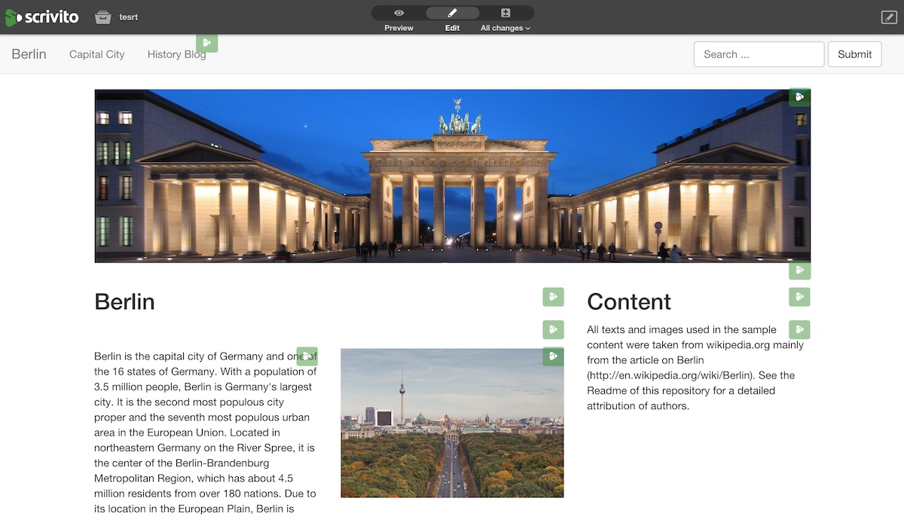

# Scrivito Example App



## Basic setup

First of all you need to install the dependencies of the app with the following command:

```
bundle install
```

To configure the cms you need to create a new file named `.env` located in the 
root of your rails app and add the following content to it:

```
SCRIVITO_TENANT=<your-tenant-name>
SCRIVITO_API_KEY=<your-api-key>
```

The example app uses [dotenv](https://github.com/bkeepers/dotenv) to load the ENV
variables that Scrivito needs in `development` and `test` mode. If you want to start
it in `production` or deploy it to heroku you have to take care of setting the ENV
variables yourself.

You can just copy these settings from your dashboard at [scrivito.com/dashboard](https://scrivito.com/dashboard).

The app expects a specific content structure in the CMS. This structure is
created using migrations, similar to the ActiveRecord migrations that create
database tables. You can execute the migrations using this command:

```
bundle exec rake scrivito:migrate scrivito:migrate:publish
```

Please note, the migrations require the tenant to be empty. If your tenant only contains data
that is disposable, you can delete your existing tenant and create another one from scratch
using the dashboard at [scrivito.com](https://scrivito.com/dashboard). The new tenant will
have new credentials, so you will have to update the configuration file.

## Example Content

The migrations also generate some example pages so the app is not empty when you first start it. If you want to start with a blank CMS and do your own thing just delete the migration-file:

```
scrivito/migrate/20141127102237_generate_seed_content_migration.rb
```

The example text content was taken from the wikipedia articles:
[Berlin](http://en.wikipedia.org/wiki/Berlin) and
[History of Berlin](http://en.wikipedia.org/wiki/History_of_Berlin).

Additionally, the following pictures were used:

- `lib/seed_data/brandenburg_gate.jpg`
"Brandenburg Gate panorama at night" by Runner1928 - Own work. Licensed under Creative Commons Attribution-Share Alike 3.0 via [Wikimedia Commons](http://commons.wikimedia.org/wiki/File:Brandenburg_Gate_panorama_at_night.jpg)

- `lib/seed_data/siegessaeule.jpg`
"Siegessaeule Aussicht 10-13 img4 Tiergarten" by A.Savin - Own work. Licensed under Creative Commons Attribution-Share Alike 3.0-2.5-2.0-1.0 via [Wikimedia Commons](http://commons.wikimedia.org/wiki/File:Siegessaeule_Aussicht_10-13_img4_Tiergarten.jpg)

- `lib/seed_data/old_map.jpg`
"ZLB-Berliner Ansichten-Januar" by J. M. F. Schmidt - Scanned by the Zentral- und Landesbibliothek Berlin (ZLB). Licensed under Public domain via [Wikimedia Commons](http://commons.wikimedia.org/wiki/File:ZLB-Berliner_Ansichten-Januar.jpg)

- `lib/seed_data/berlin_wall.jpg`
"Berlin Wall 1961-11-20" by National Archives - http://web.archive.org/web/20050206035542/http://nsarchive.chadwyck.com/bcphotox.htm. Licensed under Public domain via [Wikimedia Commons](http://commons.wikimedia.org/wiki/File:Berlin_Wall_1961-11-20.jpg)

- `lib/seed_data/reunification.jpg`
"Thefalloftheberlinwall1989" by Unknown photographer, Reproduction by Lear 21 - Original photo by unknown author. Reproduction from public documentation/memorial by Lear 21. Licensed under Creative Commons Attribution-Share Alike 3.0 via [Wikimedia Commons](http://commons.wikimedia.org/wiki/File:Thefalloftheberlinwall1989.JPG)

- `lib/seed_data/reichstag.jpg`
"Berlin Reichstag 01" by Mihael Grmek - Own work. Licensed under Creative Commons Attribution-Share Alike 3.0 via [Wikimedia Commons](http://commons.wikimedia.org/wiki/File:Berlin_Reichstag_01.jpg)
